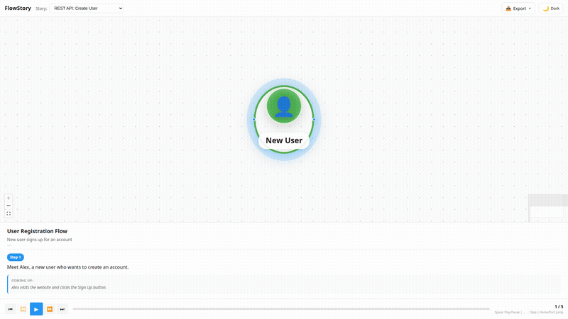
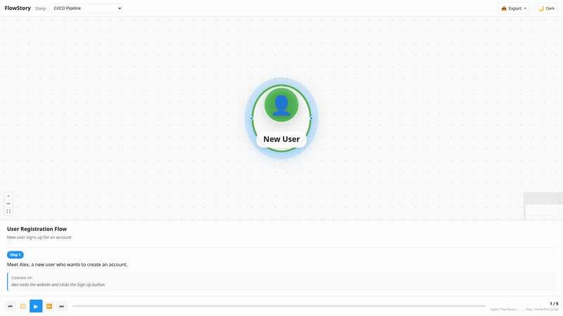
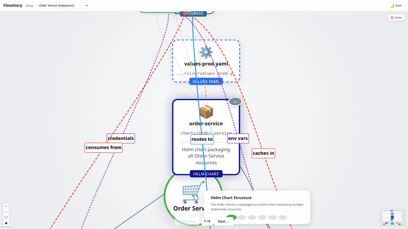

# FlowStory

[](https://github.com/karolswdev/flowstory/actions/workflows/ci.yml)
[](https://opensource.org/licenses/MIT)
[](https://www.typescriptlang.org/)
[](https://react.dev/)

Visual story-driven flow diagrams for user journeys, system architecture, and process documentation.

## 🎬 See It In Action

### User Story Flow
Walk through user journeys step by step with actors, actions, and system interactions.


### HTTP Flow
Visualize REST API sequences with request/response details, status codes, and headers.



### Service Flow
Map microservice communication patterns with sync/async calls and message queues.


### CI/CD Pipeline
Document build pipelines with stages, jobs, gates, and status indicators.



### BC Deployment
Visualize Kubernetes deployments with Helm charts, secrets, services, and infrastructure relationships.



## Features

- **YAML-based stories** - Define flows in simple, readable YAML
- **Multiple visualization types**:
  - User Stories - Actor-driven user journeys
  - HTTP Flows - REST API request/response sequences
  - Service Flows - Microservice communication diagrams
  - Pipelines - CI/CD and workflow visualizations
  - **BC Deployments** - Kubernetes/DevOps topology views
- **Step-by-step playback** - Walk through flows one step at a time
- **Export options** - PNG, SVG, PDF, and animated GIF
- **Keyboard navigation** - Space, arrows, Home/End for playback
- **React Flow powered** - Smooth, interactive diagrams
- **Three layout modes** - Radial, hierarchical, and layered (BC Deployment)

## Quick Start

```bash
# Install dependencies
npm install

# Start development server
npm run dev

# Open http://localhost:5173
```

## Creating Stories

Stories are defined in YAML format in the `stories/` directory.

### User Story Example

```yaml
version: "1"
title: "User Login Flow"
description: "Authentication journey for returning users"

actors:
  - id: user
    label: "User"
    icon: "👤"

steps:
  - id: step-1
    title: "Enter Credentials"
    activeNodes: [user, login-form]
    
  - id: step-2
    title: "Validate"
    activeNodes: [auth-service]

nodes:
  - id: user
    type: actor
    label: "User"
    position: { x: 100, y: 200 }
    
  - id: login-form
    type: action
    label: "Login Form"
    position: { x: 300, y: 200 }
    
  - id: auth-service
    type: system
    label: "Auth Service"
    position: { x: 500, y: 200 }

edges:
  - id: e1
    source: user
    target: login-form
    label: "submits"
    
  - id: e2
    source: login-form
    target: auth-service
    label: "validates"
```

### HTTP Flow Example

```yaml
version: "1"
type: http
title: "Create User API"

participants:
  - id: client
    label: "Client"
    type: client
  - id: api
    label: "API Server"
    type: server

exchanges:
  - id: create-user
    from: client
    to: api
    request:
      method: POST
      path: /api/users
      headers:
        Content-Type: application/json
      body:
        name: "John Doe"
        email: "john@example.com"
    response:
      status: 201
      headers:
        Location: /api/users/123
      body:
        id: 123
        name: "John Doe"
```

### Service Flow Example

```yaml
version: "1"
type: service
title: "Order Processing"

services:
  - id: api
    label: "API Gateway"
    type: gateway
  - id: orders
    label: "Order Service"
    type: api
  - id: queue
    label: "Order Queue"
    type: queue
  - id: processor
    label: "Order Processor"
    type: worker

calls:
  - id: c1
    from: api
    to: orders
    type: sync
    label: "createOrder()"
  - id: c2
    from: orders
    to: queue
    type: publish
    label: "OrderCreated"
  - id: c3
    from: queue
    to: processor
    type: subscribe
    label: "process"
```

### Pipeline Example

```yaml
version: "1"
type: pipeline
title: "CI/CD Pipeline"

trigger:
  type: push
  branch: main

stages:
  - id: build
    name: "Build"
    jobs:
      - id: compile
        name: "Compile"
        status: success
        duration: 45000
      - id: test
        name: "Unit Tests"
        status: success
        duration: 120000

  - id: deploy
    name: "Deploy"
    needs: [build]
    jobs:
      - id: staging
        name: "Deploy Staging"
        status: running
```

## Scripts

```bash
# Development
npm run dev          # Start dev server
npm run build        # Production build
npm run preview      # Preview production build

# Quality
npm run lint         # Run ESLint
npm run typecheck    # TypeScript check
npm run test         # Unit tests
npm run test:e2e     # E2E tests (Playwright)
npm run test:all     # All checks

# Utilities
npm run screenshots  # Capture story screenshots
```

## Project Structure

```
flowstory/
├── src/
│   ├── components/     # React components
│   │   ├── nodes/      # Node type components
│   │   └── edges/      # Edge type components
│   ├── hooks/          # Custom React hooks
│   ├── utils/          # Utilities (parser, export, layout)
│   ├── schemas/        # Zod validation schemas
│   └── types/          # TypeScript types
├── stories/            # YAML story definitions
│   ├── http/           # HTTP flow examples
│   ├── service/        # Service flow examples
│   └── pipeline/       # Pipeline examples
├── e2e/                # Playwright E2E tests
└── public/             # Static assets
```

## Keyboard Shortcuts

| Key | Action |
|-----|--------|
| `Space` | Play/Pause |
| `←` / `→` | Previous/Next step |
| `Home` | First step |
| `End` | Last step |

## Export Formats

- **PNG** - Raster image, good for docs
- **SVG** - Vector, scalable for any size
- **PDF** - Print-ready document
- **GIF** - Animated, captures full playback

## License

MIT © [karolswdev](https://github.com/karolswdev)
