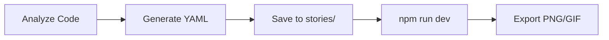
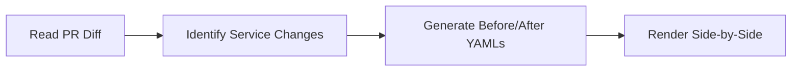
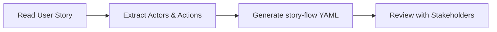

# LLM & AI Agent Integration

FlowStory is designed to work seamlessly with LLMs and AI coding agents. This guide explains how to use FlowStory in AI-assisted workflows.

## Why FlowStory + LLMs?

- **YAML is LLM-native** — LLMs understand and generate YAML naturally
- **Structured schemas** — Predictable format reduces hallucination
- **Visual output** — Complex flows become shareable diagrams
- **Step-by-step narratives** — Perfect for explaining processes

---

## Quick Start for AI Agents

### Generate a User Story

**Prompt:**
```
Create a FlowStory YAML for a user password reset flow.
Include: email entry, verification code sent, code validation, new password entry, success confirmation.
Use the story-flow renderer with actors, nodes, edges, and steps.
```

**Expected Output:**
```yaml
id: password-reset
title: Password Reset Flow
description: User resets their forgotten password
version: "2.0"

actors:
  - id: user
    name: User
    avatar: "👤"
    color: "#4CAF50"

nodes:
  - id: user-actor
    type: actor
    actorId: user
    label: User
  - id: enter-email
    type: action
    actorId: user
    label: Enters Email
  - id: send-code
    type: system
    label: Send Verification Code
  - id: email-sent-event
    type: event
    label: VerificationEmailSent
  - id: enter-code
    type: action
    actorId: user
    label: Enters Code
  - id: validate-code
    type: system
    label: Validate Code
  - id: enter-password
    type: action
    actorId: user
    label: Enters New Password
  - id: update-password
    type: system
    label: Update Password
  - id: success
    type: state
    label: Password Reset Complete
    data:
      variant: success

edges:
  - { source: user-actor, target: enter-email, type: flow }
  - { source: enter-email, target: send-code, type: flow }
  - { source: send-code, target: email-sent-event, type: event, label: publishes }
  - { source: email-sent-event, target: enter-code, type: async }
  - { source: enter-code, target: validate-code, type: flow }
  - { source: validate-code, target: enter-password, type: flow }
  - { source: enter-password, target: update-password, type: flow }
  - { source: update-password, target: success, type: flow }

steps:
  - id: step-1
    nodeIds: [user-actor, enter-email]
    narrative: "User clicks 'Forgot Password' and enters their email address."
  - id: step-2
    nodeIds: [send-code, email-sent-event]
    narrative: "System sends a verification code to the user's email."
  - id: step-3
    nodeIds: [enter-code, validate-code]
    narrative: "User enters the verification code from their email."
  - id: step-4
    nodeIds: [enter-password, update-password, success]
    narrative: "User sets a new password. Password reset complete!"
```

---

## Schema Reference

FlowStory supports 4 visualization types. Set `renderer` to choose:

| Renderer | Use Case | Key Fields |
|----------|----------|------------|
| `story-flow` | User journeys | actors, nodes, edges, steps |
| `http-flow` | REST API sequences | participants, exchanges, steps |
| `service-flow` | Microservice architecture | services, queues, calls, steps |
| `pipeline` | CI/CD workflows | stages, jobs, pipeline, steps |

### Node Types (story-flow)

| Type | Icon | Description |
|------|------|-------------|
| `actor` | 👤 | A person or system initiating actions |
| `action` | ▶️ | Something the actor does |
| `decision` | ◇ | Branching point |
| `system` | ⚙️ | Backend processing |
| `event` | ⚡ | Domain event published |
| `state` | ● | End state (success/error/warning) |

### Edge Types (story-flow)

| Type | Style | Description |
|------|-------|-------------|
| `flow` | Solid | Sequential flow |
| `event` | Dashed | Event publishing |
| `async` | Dotted | Async/eventual |
| `error` | Red | Error path |

---

## Example Prompts

### HTTP API Documentation

```
Generate a FlowStory http-flow YAML for this OpenAPI endpoint:

POST /api/v1/orders
- Request: { items: [...], shipping: {...} }
- Response 201: { orderId, status, estimatedDelivery }
- Response 400: { error, details }

Include client, API gateway, and order service as participants.
```

### Microservice Architecture

```
Create a FlowStory service-flow YAML showing how an order is processed:

1. API Gateway receives order
2. Order Service validates and saves
3. Publishes OrderCreated to Kafka
4. Inventory Service consumes and reserves stock
5. Notification Service sends confirmation email

Use appropriate service types (gateway, api, worker) and call types (sync, publish, subscribe).
```

### CI/CD Pipeline

```
Generate a FlowStory pipeline YAML for this GitHub Actions workflow:

- Build stage: compile, lint (parallel)
- Test stage: unit tests, integration tests (parallel, needs build)
- Deploy staging: deploy, smoke tests (sequential)
- Deploy production: requires approval gate, then deploy

Show job dependencies and status indicators.
```

### Architecture from Code

```
Analyze this code and generate a FlowStory service-flow YAML:

[paste service code here]

Show all external service calls, database interactions, and message queue usage.
```

---

## Tips for Better Results

### 1. Be Specific About Schema Version
```yaml
version: "2.0"  # Enables auto-layout (no position required)
```

### 2. Use Meaningful IDs
```yaml
# Good
nodes:
  - id: validate-payment
  - id: payment-failed-event

# Avoid
nodes:
  - id: node1
  - id: node2
```

### 3. Include Narratives for Steps
```yaml
steps:
  - id: step-1
    nodeIds: [user, login-form]
    narrative: "User enters credentials and clicks Sign In."
```

### 4. Leverage Auto-Layout
With `version: "2.0"`, positions are optional. FlowStory will auto-arrange nodes.

### 5. Validate Before Rendering
Save to `stories/` directory and check the browser console for schema errors.

---

## Agent Workflows

### Workflow 1: Documentation Generation



### Workflow 2: Architecture Review



### Workflow 3: Requirements Visualization



---

## File Locations

```
flowstory/
├── stories/           # Put your YAML files here
│   ├── http/          # HTTP flow stories
│   ├── service/       # Service flow stories
│   └── pipeline/      # Pipeline stories
├── docs/              # Documentation
└── screenshots/       # Exported images (gitignored)
```

---

## Validation

Check your YAML is valid by:

1. **Browser Console** — Errors appear if schema validation fails
2. **TypeScript** — Import and validate with Zod schemas:
   ```typescript
   import { storySchema } from './schemas';
   const result = storySchema.safeParse(yaml);
   ```

---

## Coming Soon

- **CLI validation**: `flowstory validate story.yaml`
- **Headless export**: `flowstory export story.yaml --format gif`
- **MCP integration**: Use FlowStory as a Claude Desktop tool

---

## Examples

See the `stories/` directory for complete examples:

- `stories/http/user-creation.yaml` — REST API flow
- `stories/service/order-processing.yaml` — Microservice choreography
- `stories/pipeline/ci-cd-deploy.yaml` — GitHub Actions pipeline
